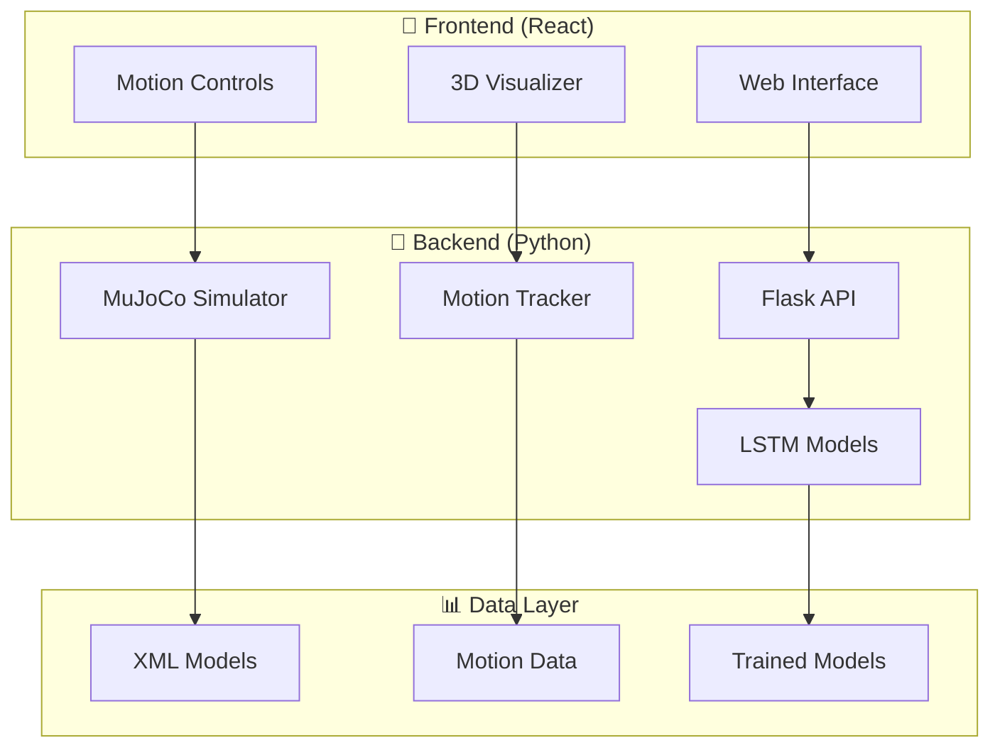

# Movement Tracking MuJoCo

<div align="center">


</div>

<div align="center">


### Advanced Humanoid Movement Simulation & Prediction System

[](https://python.org)
[](https://reactjs.org)
[](https://mujoco.org)
[](https://tensorflow.org)
[](https://opensource.org/licenses/MIT)

</div>

## 🚀 Overview

Movement Tracking MuJoCo is a cutting-edge project that harnesses the power of **MuJoCo physics simulation** combined with **machine learning** to create an intelligent humanoid movement analysis system. This project seamlessly integrates:

- **Advanced Physics Simulation** using MuJoCo engine
- **LSTM-based Motion Prediction** for movement forecasting
- **Real-time Visualization** with interactive React frontend
- **Motion Tracking & Analysis** for biomechanical research

Perfect for researchers in **robotics**, **biomechanics**, **machine learning**, and anyone interested in human movement simulation and prediction.

## Table of Contents

- [Overview](#overview)
- [Features](#features)
- [Requirements](#requirements)
- [Installation](#installation)
- [Usage](#usage)
- [Project Structure](#project-structure)
- [Examples](#examples)
- [Contributing](#contributing)
- [License](#license)
- [Contact](#contact)

## Overview

This project simulates a humanoid model (e.g., `humanoid.xml`) using MuJoCo, tracks its motion, and employs an LSTM model to predict or analyze movement sequences. A React-based GUI allows users to interact with the simulation, load data, train models, and visualize results in real-time or post-processed formats.

## ✨ Key Features

<div align="center">

| 🤖 Simulation | 🧠 AI/ML | 🎨 Visualization | 🔧 Development |
|:---:|:---:|:---:|:---:|
| **Realistic Physics** | **LSTM Networks** | **Real-time Rendering** | **Modular Design** |
| MuJoCo-powered humanoid simulation | Motion prediction & forecasting | Interactive 3D visualization | Extensible architecture |
| **Motion Capture** | **Data Processing** | **Web Interface** | **Easy Integration** |
| Joint tracking & analysis | CSV data handling | React-based GUI | RESTful API endpoints |

</div>

### 🎯 Core Capabilities

- **🏃‍♂️ Advanced Humanoid Simulation**
  - Realistic movement simulation using MuJoCo physics engine
  - Support for complex humanoid models and custom XML configurations
  - Real-time physics calculations with accurate collision detection

- **📊 Intelligent Motion Tracking**
  - Captures joint angles, velocities, accelerations, and positions
  - Processes and analyzes biomechanical data
  - Exports motion data to CSV format for further analysis

- **🧠 LSTM-based Prediction**
  - Deep learning models for motion sequence prediction
  - Time-series analysis of movement patterns
  - Customizable neural network architectures

- **🎨 Interactive Visualization**
  - Modern React-based web interface
  - Real-time 3D simulation rendering
  - Matplotlib integration for data plotting
  - Responsive design for all devices

- **🔬 Research-Ready Platform**
  - Modular design for easy customization
  - Support for custom sensors and algorithms
  - Comprehensive data export capabilities
  - Integration with popular ML frameworks

## 📋 Prerequisites

<div align="center">

| Component | Version | Purpose |
|:----------|:--------|:---------|
|  | 3.7+ | Backend processing & ML |
|  | 16+ | Frontend development |
|  | Latest | Physics simulation |

</div>

### 🔧 System Dependencies

- **MuJoCo Physics Engine** - [Installation Guide](https://mujoco.org/docs/installation.html)
- **Python Dependencies** - Listed in `backend/requirements.txt`
- **Node.js Dependencies** - Listed in `frontend/package.json`

### 📦 Key Python Packages

```
tensorflow>=2.0    # Deep learning framework
numpy>=1.19        # Numerical computing
flask>=2.0         # Web framework
matplotlib>=3.3    # Data visualization
pandas>=1.2        # Data manipulation
mujoco>=2.0        # MuJoCo Python bindings
```

## ⚡ Quick Setup

### 🚀 One-Click Installation

```bash
# Clone the repository
git clone https://github.com/17arhaan/Movement_Tracking_Mujoco.git
cd Movement_Tracking_Mujoco

# Install everything at once
chmod +x setup.sh && ./setup.sh
```

### 📝 Manual Installation

<details>
<summary><b>🐍 Backend Setup (Python)</b></summary>

```bash
# 1. Create virtual environment
python -m venv venv

# 2. Activate virtual environment
# On macOS/Linux:
source venv/bin/activate
# On Windows:
# venv\Scripts\activate

# 3. Install MuJoCo (follow official guide)
# https://mujoco.org/docs/installation.html

# 4. Install Python dependencies
pip install -r backend/requirements.txt

# 5. Verify installation
python backend/mujoco_sim.py
```

</details>

<details>
<summary><b>⚛️ Frontend Setup (React)</b></summary>

```bash
# 1. Navigate to frontend directory
cd frontend

# 2. Install Node.js dependencies
npm install

# 3. Start development server
npm start

# 4. Open browser to http://localhost:3000
```

</details>

<details>
<summary><b>🔍 Verification Steps</b></summary>

1. **Check MuJoCo Installation**:
   ```bash
   python -c "import mujoco; print('MuJoCo installed successfully!')"
   ```

2. **Verify Backend**:
   ```bash
   cd backend && python api.py
   # Should start Flask server on http://localhost:5000
   ```

3. **Test Frontend**:
   ```bash
   cd frontend && npm start
   # Should open React app on http://localhost:3000
   ```

4. **Ensure Model Files**:
   - Place `humanoid.xml` in `backend/` directory
   - Or adjust model paths in `mujoco_sim.py`

</details>

## 🎮 Usage Guide

### 🚀 Getting Started (3 Simple Steps)

<div align="center">

| Step | Action | Command | Result |
|:----:|:------:|:--------|:-------|
| **1** | 🔧 **Start Backend** | `cd backend && python api.py` | Flask server at `localhost:5000` |
| **2** | 🎨 **Launch Frontend** | `cd frontend && npm start` | React app at `localhost:3000` |
| **3** | 🎉 **Start Exploring** | Open browser | Interactive simulation interface |

</div>

---

## 🖥️ Detailed Usage

### Running the Backend

Launch the Flask API to manage simulation and LSTM processing:

```bash
cd backend
python api.py
```

The server runs at `http://localhost:5000`.

### Running the Frontend

Start the React GUI:

```bash
cd frontend
npm start
```

Visit `http://localhost:3000` to access the interface.

### Running Standalone Simulation (Optional)

To run a standalone MuJoCo simulation without the GUI:

```bash
cd backend
python mujoco_sim.py
```

This renders the humanoid model with dummy joint angles.

### Training the LSTM Model

The GUI’s "Train LSTM" button triggers training via the API. Alternatively, run standalone:

```bash
cd backend
python lstm_model.py
```

Modify `lstm_model.py` to load your dataset.

### Visualization

The GUI’s "Simulate Motion" button renders MuJoCo output. For standalone plots:

```bash
cd backend
python motion_tracker.py  # Add Matplotlib plotting logic here
```

## 🏗️ Project Architecture

<div align="center">



</div>

### 📁 Directory Structure

```
Movement_Tracking_Mujoco/
├── 🔧 backend/                        # Python backend ecosystem
│   ├── 🎯 api.py                     # Flask RESTful API server
│   ├── 🤖 mujoco_sim.py              # MuJoCo physics simulation engine
│   ├── 🧠 lstm_model.py              # Deep learning model architecture
│   ├── 📊 motion_tracker.py          # Motion capture & analysis
│   ├── 📋 requirements.txt           # Python dependency specifications
│   └── 🗂️ models/                   # Trained model storage
│
├── 🎨 frontend/                       # React web application
│   ├── 📱 src/
│   │   ├── ⚛️ App.js                # Main application component
│   │   ├── 🎮 MotionControl.js       # Simulation control interface
│   │   ├── 🖼️ Visualizer.js         # Real-time visualization
│   │   ├── 🔗 index.js              # Application entry point
│   │   └── 🎨 styles/               # CSS styling
│   ├── 🌐 public/
│   │   ├── 📄 index.html            # HTML template
│   │   └── 🖼️ assets/              # Static assets
│   ├── 📦 package.json              # Node.js dependencies
│   └── 🔧 build/                    # Production build output
│
├── 🤖 models/                         # MuJoCo model definitions
│   ├── 🚶 humanoid.xml             # Human biomechanical model
│   ├── 🎯 environments/             # Custom environments
│   └── 🔧 configs/                  # Model configurations
│
├── 📊 data/                          # Training & simulation data
│   ├── 📈 training/                 # LSTM training datasets
│   ├── 📉 results/                  # Simulation outputs
│   └── 🔄 logs/                     # System logs
│
├── 🧪 test_cases/                    # Development test scenarios
│   ├── 🧪 test1/                    # Basic simulation tests
│   ├── 🧪 test2/                    # Advanced ML workflows
│   └── 🧪 test3/                    # Integration tests
│
├── 📚 docs/                          # Documentation
│   ├── 📖 api.md                    # API documentation
│   ├── 🔬 research.md               # Research methodology
│   └── 🎯 tutorials/                # User tutorials
│
├── 🛠️ scripts/                       # Utility scripts
│   ├── 🚀 setup.sh                 # Automated setup
│   ├── 🧹 cleanup.py               # Data preprocessing
│   └── 📊 analysis.py               # Data analysis tools
│
├── 📄 LICENSE                        # MIT License
├── 📖 README.md                      # This file
└── ⚙️ .gitignore                    # Git ignore patterns
```

### 🔄 Data Flow

1. **🌐 User Interaction** → React frontend captures user inputs
2. **📡 API Communication** → Frontend sends requests to Flask backend
3. **🤖 Physics Simulation** → MuJoCo processes movement calculations
4. **📊 Data Processing** → Motion tracker analyzes simulation output
5. **🧠 ML Prediction** → LSTM models process temporal sequences
6. **🎨 Visualization** → Results rendered in real-time interface

## Examples

### Example 1: Simulate Random Motion
- Start the backend (`python backend/api.py`).
- Open the GUI (`npm start` in `frontend/`).
- Click "Simulate Motion" to render a random humanoid pose.

### Example 2: Train LSTM on Dummy Data
- Run `python backend/lstm_model.py` standalone to train on random sequences.
- Check the console for training progress and saved model (`lstm_model.h5`).

### Example 3: Visualize Motion Data
- Modify `motion_tracker.py` to output joint angles to a CSV.
- Use Matplotlib in a custom script (e.g., `visualize.py`):
  ```python
  import matplotlib.pyplot as plt
  import pandas as pd
  data = pd.read_csv("motion_data.csv")
  plt.plot(data["time"], data["joint_1"])
  plt.show()
  ```

## Contributing

Contributions are encouraged! To contribute:

1. Fork the repository.
2. Create a branch (`git checkout -b feature/your-feature`).
3. Commit changes (`git commit -m "Add your feature"`).
4. Push to the branch (`git push origin feature/your-feature`).
5. Submit a pull request.

For significant changes, open an issue first. Adhere to the project’s coding style and document new features.

## License

This project is licensed under the MIT License. See [LICENSE.md](LICENSE.md) for details.

## 📞 Contact & Support

<div align="center">

### 👨‍💻 **Arhaan**
**AI/ML Engineer | Robotics Researcher**

[](mailto:17arhaan@gmail.com)
[](https://arhaanportfolio.in)
[](https://github.com/17arhaan)

</div>

### 🤝 Get Involved

- 🐛 **Found a bug?** [Open an issue](https://github.com/17arhaan/Movement_Tracking_Mujoco/issues)
- 💡 **Have an idea?** [Start a discussion](https://github.com/17arhaan/Movement_Tracking_Mujoco/discussions)
- 🔧 **Want to contribute?** Check our [Contributing Guidelines](#contributing)
- 📧 **Need help?** Email us at [17arhaan@gmail.com](mailto:17arhaan@gmail.com)

### 🌟 Show Your Support

If this project helped you, please consider:

- ⭐ **Starring** the repository
- 🍴 **Forking** for your own experiments  
- 📢 **Sharing** with the community
- 💬 **Contributing** improvements

---

<div align="center">

**🚀 Built with passion for advancing human movement simulation**

*Made with ❤️ by [Arhaan](https://github.com/17arhaan)*

</div>

